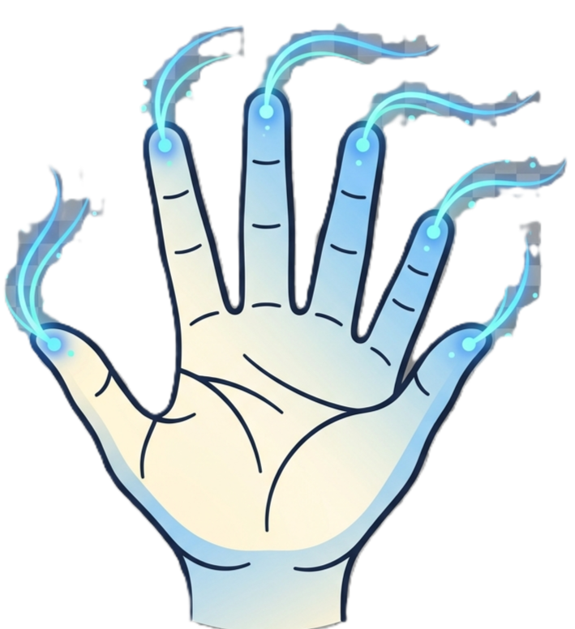
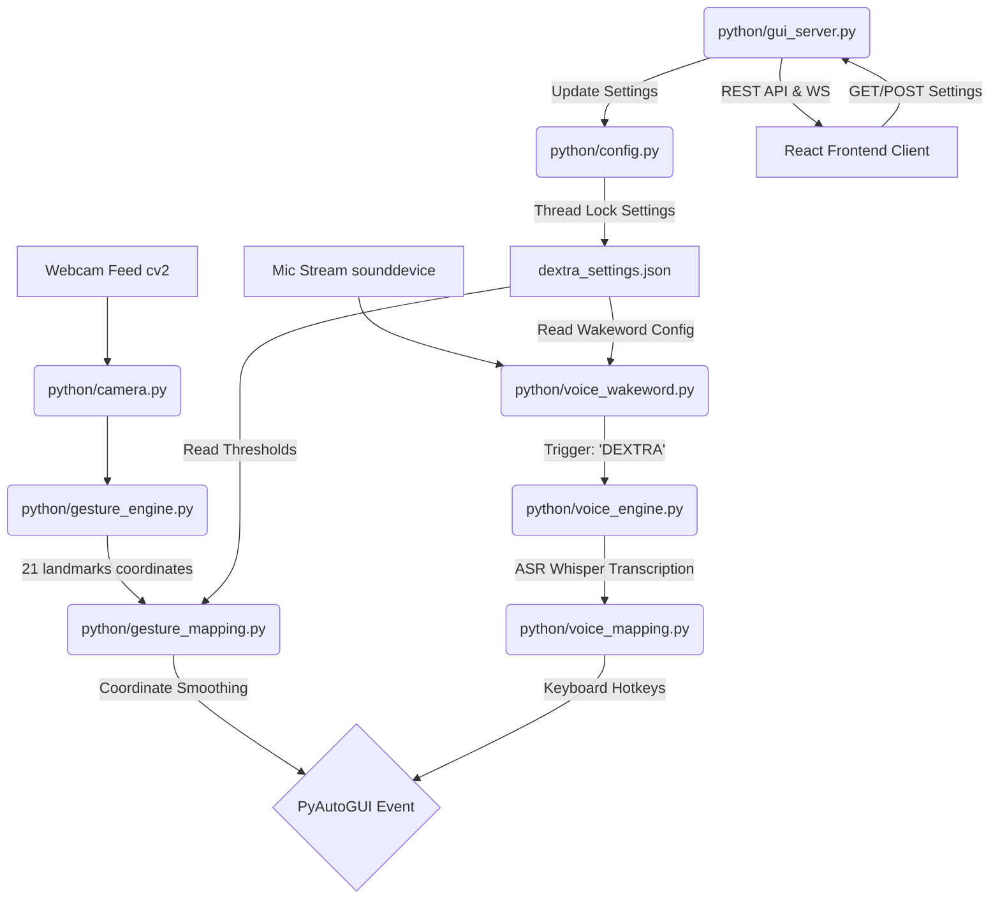

<center>  </center>

# DEXTRA - Control Without Contact

```
██████╗ ███████╗██╗  ██╗████████╗██████╗  █████╗ 
██╔══██╗██╔════╝╚██╗██╔╝╚══██╔══╝██╔══██╗██╔══██╗
██║  ██║█████╗   ╚███╔╝    ██║   ██████╔╝███████║
██║  ██║██╔══╝   ██╔██╗    ██║   ██╔══██╗██╔══██║
██████╔╝███████╗██╔╝ ██╗   ██║   ██║  ██║██║  ██║
╚═════╝ ╚══════╝╚═╝  ╚═╝   ╚═╝   ╚═╝  ╚═╝╚═╝  ╚═╝
```

> **Control Without Contact** · Gesture-Driven Computing, Reimagined
>
> Powered by MediaPipe · OpenCV · PyAutoGUI · Python · React · Hugging Face

---

[](https://opensource.org/licenses/MIT)
[](https://www.python.org/)
[](https://react.dev/)
[](https://fastapi.tiangolo.com/)
[](https://github.com/google/mediapipe)
[](https://huggingface.co/docs/transformers/index)

---

## Table of Contents
1. [Executive Summary & Concept](#executive-summary--concept)
2. [Problem Statement](#problem-statement)
3. [Developer Story & Team Assignments](#developer-story--team-assignments)
4. [System Architecture & Data Flow](#system-architecture--data-flow)
5. [Folder & Component Structure](#folder--component-structure)
6. [Core Gesture Engine & Gesture Catalog](#core-gesture-engine--gesture-catalog)
7. [Voice Command Engine & Command Catalog](#voice-command-engine--command-catalog)
8. [Settings GUI & Gesture Trainer](#settings-gui--gesture-trainer)
9. [API & WebSocket Specifications](#api--websocket-specifications)
10. [Configuration Schema](#configuration-schema)
11. [System Requirements](#system-requirements)
12. [Installation & Deployment](#installation--deployment)
13. [Verification & Testing](#verification--testing)
14. [Challenges, Mitigations & Future Roadmap](#challenges-mitigations--future-roadmap)
15. [Development Roadmap (14-Day Timeline)](#development-roadmap-14-day-timeline)
16. [Contributors & Licensing](#contributors--licensing)

---

## Executive Summary & Concept

DEXTRA is a software solution that replaces the conventional computer mouse with real-time hand gesture recognition via a standard webcam. Using Google's MediaPipe framework for hand landmark detection, DEXTRA maps natural hand gestures to every standard mouse operation — including cursor movement, left and right clicking, double-clicking, drag-and-drop, and scrolling — without requiring specialized hardware depth cameras.

DEXTRA is further enhanced by:
- **Voice Command Engine**: 40+ spoken commands across 6 categories powered by local Hugging Face transformer models (`openai/whisper-tiny`).
- **Settings GUI**: A browser-based React SPA local control panel served by FastAPI.
- **Gesture Trainer Module**: Allows users to record, name, and assign custom hand poses to OS shortcuts.

**Key Value**: DEXTRA delivers a fully mouse-free computing experience using 22 hand gestures, 40+ voice commands, and a standard laptop webcam — no specialized hardware required.

---

## Problem Statement

The physical mouse has remained the dominant pointing device for over four decades. While reliable, it presents barriers in several real-world scenarios:
1. **Accessibility**: Users with limited hand mobility or physical disabilities struggle with precise physical mouse control.
2. **Hygiene-Sensitive Environments**: Medical, cleanroom, and laboratory settings require touchless interaction with computer systems.
3. **Space Constraints**: Mobile workers and students in crowded environments often lack a flat physical surface for mouse operation.
4. **AR/VR & Kiosk Environments**: Emerging interfaces have no surface on which a physical mouse can operate.
5. **Fatigue & RSI**: Prolonged mouse use contributes to Repetitive Strain Injury.

DEXTRA addresses all five scenarios simultaneously by providing a hygienic, natural, and hardware-free input alternative.

---

## Developer Story & Team Assignments

### Team Member Assignments & Responsibilities

| Team Member | Role / Focus Area | Assigned Modules | Key Responsibilities |
| :--- | :--- | :--- | :--- |
| **Salman** | Core Gesture & Tracking Engine | `python/camera.py`<br>`python/gesture_engine.py`<br>`python/gesture_mapping.py` | Video capture, MediaPipe 21 landmark detection, smoothing filter, PyAutoGUI mouse event binding. |
| **Logesh** | Voice Command Engine | `python/voice_wakeword.py`<br>`python/voice_engine.py`<br>`python/voice_mapping.py` | Background audio capture, "DEXTRA" wakeword monitor, Hugging Face Whisper ASR transcription, shortcut mapper. |
| **Muthamil** | FastAPI Backend GUI Server | `python/config.py`<br>`python/gui_server.py`<br>`python/main.py` | File lock thread safety on config JSONs, FastAPI REST & WebSockets JPEG stream, system CLI launcher menu. |
| **Godfrey** | React Settings & Trainer SPA | `Frontend/` React Application | Vite React SPA layout, WebSocket HTML5 Canvas video feed renderer, voice controller status component, form bindings. |

---

## System Architecture & Data Flow

DEXTRA's architecture separates tasks into distinct background daemon threads. Visual tracking, speech transcription, configuration management, and the API server run concurrently, sharing state via configuration files and thread-safe queues.

```
+------------------+     +--------------------+     +-------------------+
|  Webcam Input    | --> | OpenCV/MediaPipe   | --> | PyAutoGUI Mouse   |
|  (30+ FPS Frame) |     | Landmark Engine    |     | Event Execution   |
+------------------+     +--------------------+     +-------------------+
                                                               ^
+------------------+     +--------------------+               |
|  Mic Audio       | --> | Hugging Face       | --------------+
|  (Local Stream)  |     | Whisper STT Engine |
+------------------+     +--------------------+
```

### Thread Communication & Data Flow



### Data Processing Pipeline
1. **Webcam Frame Capture**: OpenCV captures a raw BGR frame at 30+ FPS.
2. **Pre-processing**: Frame is mirrored (flipped) and converted to RGB color space.
3. **Hand Detection**: MediaPipe locates 21 3D landmark coordinates on the hand.
4. **Gesture Logic**: Python checks finger extension states and landmark Euclidean distances.
5. **Coordinate Mapping**: NumPy interpolates index finger position to screen resolution.
6. **Smoothing Filter**: Moving average buffer removes hand tremor jitter.
7. **Mouse Execution**: PyAutoGUI issues OS-level pointer or hotkey events.
8. **UI Overlay**: Annotated frame delivery to WebSocket clients at 30 FPS.

---

## Folder & Component Structure

```
Dextra/
├── README.md                        # Primary documentation & architecture guide
├── LICENSE                          # MIT open-source license
├── dextra_settings.json             # System configurations and thresholds database
├── dextra_custom_gestures.json      # Saved custom trained hand poses database
├── requirements.txt                 # Python dependencies manifest
├── run_dextra.ps1                   # PowerShell automated launcher script
├── python/                          # Python backend daemon files
│   ├── main.py                      (CLI launcher interface & menu)
│   ├── config.py                    (Thread-safe settings manager)
│   ├── camera.py                    (OpenCV webcam frame capture loop)
│   ├── gesture_engine.py            (MediaPipe hand landmarker engine)
│   ├── gesture_mapping.py           (PyAutoGUI mouse movements and coordinates filter)
│   ├── voice_wakeword.py            (Background audio wakeword monitor)
│   ├── voice_engine.py              (Hugging Face speech-to-text pipeline)
│   ├── voice_mapping.py             (Shortcut and command execution mapper)
│   └── gui_server.py                (FastAPI REST & WebSockets server)
├── Frontend/                        # React frontend client
│   ├── package.json                 # Node package manifest
│   ├── vite.config.js               # Vite configuration proxying requests to port 8000
│   ├── index.html                   # HTML SPA template
│   └── src/                         # React components & styles
│       ├── main.jsx                 # Client entry point
│       ├── App.jsx                  # Main router navigation wrapper
│       ├── index.css                # CSS variables, glassmorphism, and dark theme
│       └── components/              # Modular UI view components
│           ├── Dashboard.jsx        (System Overview & status KPIs)
│           ├── Trainer.jsx          (Gesture Trainer & canvas recorder)
│           ├── VoiceController.jsx  (Voice engine controls & logs)
│           ├── Settings.jsx         (Configuration sliders and options)
│           └── CommandPalette.jsx   (Searchable command modal)
└── tests/                           # Unit & Integration test suites
    ├── test_api.py                  (FastAPI REST endpoint tests)
    ├── test_camera.py               (OpenCV capture & setting tests)
    ├── test_config.py               (SettingsManager CRUD & fallback tests)
    ├── test_gesture_mapping.py      (Finger states & posture heuristic tests)
    └── test_voice_mapping.py        (Command matching & alias tests)
```

---

## Core Gesture Engine & Gesture Catalog

DEXTRA tracks 21 3D coordinates on the hand, using landmark spatial relationships to classify gestures.

```
       8   12  16  20
       |   |   |   |
       7   11  15  19
   4   |   |   |   |
   |   6   10  14  18
   3   \___|___|___/
    \      5   9  13 17
     2      \  |  /  /
      \      \ | /  /
       1______\|/  /
              |   /
              0__/
```

### Complete 22 Gesture Catalog

#### Cursor & Click
| Gesture | Description | Action |
| :--- | :--- | :--- |
| ☝️ **Index Finger Up** | Only index finger extended, hand moves freely | Move Cursor |
| 🤏 **Quick Pinch** | Index + thumb touch and release | Left Click |
| 🤏🤏 **Double Pinch** | Two rapid pinches within 0.35s | Double Click |
| ✊ **Hold Pinch + Move** | Pinch held >0.6s while moving hand | Drag & Drop |
| 🖕 **Middle + Thumb Pinch** | Middle finger + thumb touch | Right Click |
| 🤌 **Ring + Thumb Pinch** | Ring finger + thumb touch | Middle Click |
| 👌 **OK Sign** | Index + thumb form circle, other fingers extended | Confirm / Enter Key |

#### Scrolling & Navigation
| Gesture | Description | Action |
| :--- | :--- | :--- |
| ✌️ **Two Fingers Up + Move** | Index & middle extended, move up/down | Vertical Scroll |
| ✌️↔ **Two Fingers Lateral** | Index & middle extended, move left/right | Horizontal Scroll |
| 👋 **Wrist Flick Left** | Quick leftward wrist snap (index up) | Navigate Back |
| 👋 **Wrist Flick Right** | Quick rightward wrist snap (index up) | Navigate Forward |
| ☝️⬆ **Index Hold Up (1s)** | Index up, hand stationary for 1 second | Page Up |
| ☝️⬇ **Index Hold Down (1s)** | Index down, hand stationary for 1 second | Page Down |

#### Zoom
| Gesture | Description | Action |
| :--- | :--- | :--- |
| 🤏➡ **Pinch Expand** | Thumb & index spread outward rapidly | Zoom In (`Ctrl +`) |
| 🤏⬅ **Pinch Contract** | Thumb & index pinch inward rapidly | Zoom Out (`Ctrl -`) |

#### Window Management
| Gesture | Description | Action |
| :--- | :--- | :--- |
| 🖖 **V-Spread** | Index & middle spread wide apart | Switch Window (`Alt+Tab`) |
| ✊ **Closed Fist (still)** | All fingers curled, no movement for 0.5s | Minimize Window |
| 🖐 **Four Fingers Up** | All fingers except thumb extended | Close Window (`Alt+F4`) |
| 🤟 **Spider-Man Pose** | Thumb + index + pinky extended | Open Start Menu |

#### System Controls
| Gesture | Description | Action |
| :--- | :--- | :--- |
| ✋ **Open Palm** | All 5 fingers extended, hand still | Freeze / Rest Mode |
| 🤙 **Shaka Sign** | Thumb + pinky extended | Toggle Voice Mode |
| 🤞 **Crossed Fingers** | Index + middle crossed | Lock Screen |

---

## Voice Command Engine & Command Catalog

DEXTRA transcribes speech locally using Hugging Face's `transformers` library (`openai/whisper-tiny`).

### 40+ Voice Commands Catalog

| Category | Commands |
| :--- | :--- |
| **Editing** | `"copy"`, `"cut"`, `"paste"`, `"undo"`, `"redo"`, `"select all"`, `"save"`, `"save as"`, `"find"`, `"replace"`, `"delete"`, `"bold"`, `"italic"`, `"underline"`, `"new line"` |
| **Navigation** | `"scroll up"`, `"scroll down"`, `"scroll top"`, `"scroll bottom"`, `"go back"`, `"go forward"`, `"page up"`, `"page down"`, `"zoom in"`, `"zoom out"`, `"reset zoom"` |
| **Window & Tab** | `"close tab"`, `"new tab"`, `"reopen tab"`, `"next tab"`, `"previous tab"`, `"new window"`, `"close window"`, `"switch window"`, `"minimize"`, `"maximize"`, `"restore"`, `"task view"`, `"snap left"`, `"snap right"` |
| **Media & Volume** | `"volume up"`, `"volume down"`, `"mute"`, `"unmute"`, `"play"`, `"pause"`, `"play pause"`, `"next track"`, `"previous track"`, `"fullscreen"`, `"exit fullscreen"` |
| **System & Apps** | `"screenshot"`, `"open explorer"`, `"show desktop"`, `"lock screen"`, `"open settings"`, `"task manager"`, `"open notepad"`, `"open calculator"` |
| **DEXTRA Control** | `"start listening"`, `"stop listening"`, `"open trainer"`, `"open settings"`, `"toggle gestures"`, `"calibrate"`, `"help"` |

---

## Settings GUI & Gesture Trainer

### Settings GUI
The React-based settings dashboard enables users to configure system parameters without code edits:
- Camera Selection (internal webcam index `0` vs external USB camera `1`).
- Cursor Smoothing Level (1–15 frame moving average buffer).
- Click Distance Threshold (pixels).
- Drag Hold Time & Double-click Timing.
- Cooldown Period between actions.

### Gesture Trainer
The Gesture Trainer features a real-time HTML5 Canvas preview fed via WebSockets (`/trainer/stream`). Users can:
1. Hold a custom hand posture in front of the webcam.
2. Observe live 5-finger extended/curled state indicators.
3. Enter a custom gesture name and map it to a system action.
4. Hit Record (3-second countdown) to save custom postures to `dextra_custom_gestures.json`.

---

## API & WebSocket Specifications

### REST API Endpoints
- `GET /health` -> `{"status": "ok"}`
- `GET /settings` -> Returns `dextra_settings.json` parameters.
- `POST /settings` -> Persists updated configuration options.
- `GET /gestures` -> Returns list of saved custom gestures.
- `POST /gestures` -> Saves a new custom gesture payload.
- `DELETE /gestures/{name}` -> Deletes a saved custom gesture by name.
- `GET /api/system-status` -> Returns live statuses for mouse engine, voice engine, camera index, smoothing frames, and gesture counts.
- `GET /api/all-gestures` -> Returns combined list of built-in and custom gestures.
- `GET /api/voice-commands` -> Returns voice command categories reference.
- `POST /api/engines/start` -> Activates camera tracking and voice daemon worker threads.

### WebSocket Streams
- `WS /trainer/stream`: Streams annotated camera JPEG frames and real-time finger state metadata at 30 FPS.
- `WS /voice/stream`: Streams real-time voice status events, live transcriptions, and executed command logs.

---

## Configuration Schema

### `dextra_settings.json`
```json
{
  "camera_index": 0,
  "cursor_smoothing": 5,
  "click_threshold_px": 30,
  "drag_hold_time_sec": 0.6,
  "double_click_time_sec": 0.35,
  "cooldown_period_sec": 0.3,
  "voice_commands_enabled": true,
  "gesture_trainer_enabled": true
}
```

---

## System Requirements

### Hardware Requirements
- **Webcam**: Built-in or USB webcam (720p recommended, 480p minimum).
- **Processor**: Intel Core i5 / AMD Ryzen 5 or equivalent (2.0 GHz+).
- **RAM**: 4 GB minimum, 8 GB recommended.
- **Microphone**: Built-in or external mic.

### Software & Environment
- **Operating System**: Windows 10 / 11 (64-bit), macOS, or Linux.
- **Python**: Version 3.8, 3.9, or 3.10.
- **Node.js**: Node 18+ (for building frontend SPA assets).

---

## Installation & Deployment

### Quick Start (Automated PowerShell Script)
```powershell
.\run_dextra.ps1
```

### Manual Installation Steps
```bash
# 1. Clone repository
git clone https://github.com/your-org/Dextra.git
cd Dextra

# 2. Set up Python virtual environment & dependencies
python -m venv .venv
.venv\Scripts\activate      # Windows
pip install -r requirements.txt

# 3. Build React Frontend SPA
cd Frontend
npm install
npm run build
cd ..

# 4. Launch DEXTRA Launcher Menu
python python/main.py
```

---

## Verification & Testing

### Running Full Automated Test Suites

#### 1. Python Unit & API Test Suite
```powershell
python -m unittest discover -s tests -p "test_*.py"
```
*(Runs 24 unit & API endpoint tests covering settings CRUD, gesture heuristics, voice mappings, and REST endpoints).*

#### 2. JavaScript / Frontend Test Suite
```powershell
cd Frontend
npm test
```
*(Runs Vitest / Node test suite validating metadata schemas and API utilities).*

---

## Challenges, Mitigations & Future Roadmap

| Challenge / Risk | Mitigation Strategy |
| :--- | :--- |
| **Cursor Jitter** | Moving average smoothing buffer (configurable 1–15 frames). |
| **Accidental Clicks** | Configurable cooldown timer + Euclidean click distance threshold. |
| **Poor Lighting** | Confidence threshold tuning; recommend adequate front lighting. |
| **Gorilla Arm Fatigue** | Rest Mode ("Open Palm") gesture suspends active mouse updates. |
| **Background Noise** | Signal RMS threshold check before triggering Whisper ASR. |

### Future Enhancements
- **Kalman Filter Smoothing**: Superior jitter reduction over moving average.
- **System Tray Icon**: Silent background task control via `pystray`.
- **Multi-hand Support**: Two-hand gestures for spatial 3D rotate and multi-monitor movement.
- **Standalone Portable Installer**: Package into single-click executable via PyInstaller.

---

## Development Roadmap (14-Day Timeline)

- **Days 1–2 (Foundation)**: Webcam frame capture, MediaPipe integration, config manager base.
- **Days 3–5 (Core Gestures)**: Cursor smoothing, click/double-click/drag detection, rest mode.
- **Days 6–8 (Voice Engine)**: Audio stream sounddevice capture, wakeword detector, Hugging Face Whisper ASR.
- **Days 9–10 (GUI & Trainer)**: FastAPI REST endpoints, React SPA settings forms, WebSocket stream renderer.
- **Days 11–12 (Integration & Polish)**: Concurrent multi-threading sync, glassmorphism UI refinement.
- **Days 13–14 (Testing & Release)**: Test suite creation, latency profiling, documentation packaging.

---

## Contributors & Licensing

### Project Contributors
- **Salman** — Core Gesture & Tracking Engine
- **Logesh** — Voice Command Engine
- **Muthamil** — FastAPI Backend & Launch Systems
- **Godfrey** — React Settings & Trainer SPA

### License
DEXTRA is open-source software released under the terms of the [MIT License](file:///o:/PROJECTS/Dextra/LICENSE).
