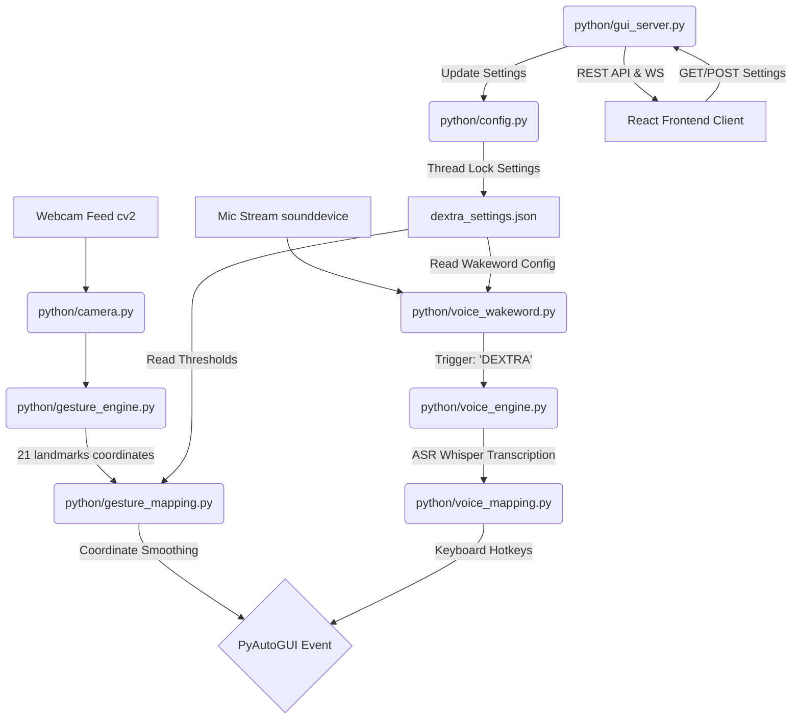
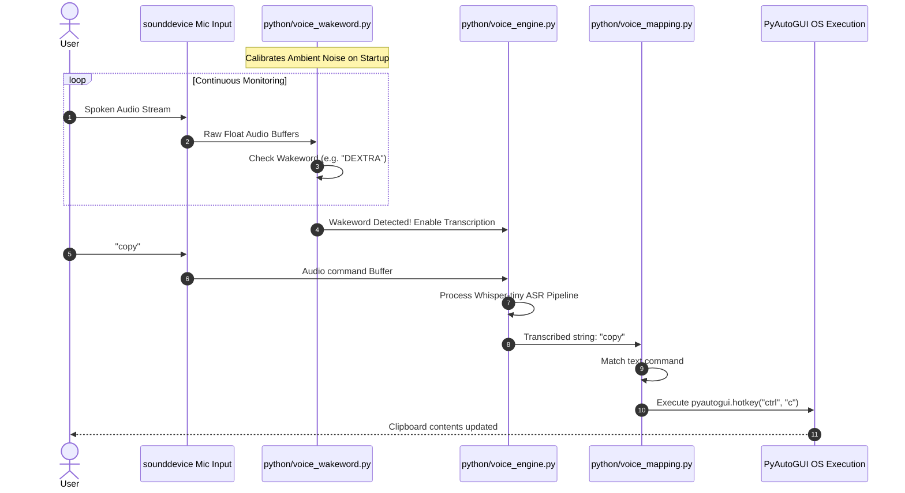
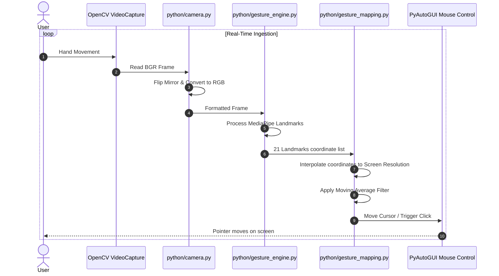

# DEXTRA - Control Without Contact

```
██████╗ ███████╗██╗  ██╗████████╗██████╗  █████╗ 
██╔══██╗██╔════╝╚██╗██╔╝╚══██╔══╝██╔══██╗██╔══██╗
██║  ██║█████╗   ╚███╔╝    ██║   ██████╔╝███████║
██║  ██║██╔══╝   ██╔██╗    ██║   ██╔══██╗██╔══██║
██████╔╝███████╗██╔╝ ██╗   ██║   ██║  ██║██║  ██║
╚═════╝ ╚══════╝╚═╝  ╚═╝   ╚═╝   ╚═╝  ╚═╝╚═╝  ╚═╝
```

> **Control Without Contact** · Gesture-Driven Computing, Reimagined
>
> Powered by MediaPipe · OpenCV · PyAutoGUI · Python · React · Hugging Face

---

[](https://opensource.org/licenses/MIT)
[](https://www.python.org/)
[](https://react.dev/)
[](https://fastapi.tiangolo.com/)
[](https://github.com/google/mediapipe)
[](https://huggingface.co/docs/transformers/index)

---

## Developer Story

### Why We Built It
Human-Computer Interaction (HCI) has been anchored to the physical desktop mouse for over four decades. While the mouse is highly precise, its dependency on fine motor controls and flat physical surfaces introduces accessibility barriers. Individuals suffering from motor disabilities, tremors, or repetitive strain injuries (RSI) find mouse interactions painful or impossible. In environments like sterile operating theatres, chemical cleanrooms, and automated warehouses, touchless computer interactions are a necessity to preserve hygiene and safety.

DEXTRA was born from the desire to break down these physical constraints. Our goal was to design a touchless desktop pointing utility that relies entirely on standard hardware: a built-in laptop webcam and integrated microphone. By bypassing the need for specialized spatial depth cameras, we wanted to make hand-gesture and local voice-driven navigation accessible to everyone.

### Who We Are
We are a team of four software engineers, each bringing specialized skills to make DEXTRA highly modular and performant:
* **Salman (Core Gesture & Tracking Engine)**: Specializes in computer vision pipelines. Salman structured the webcam stream ingestion, coordinates remapping, MediaPipe landmark data processing, and PyAutoGUI OS action bindings.
* **Logesh (Voice Command Engine)**: Expert in local deep learning and signal capture. Logesh designed the sounddevice background threads, custom wakeword classifiers, and Hugging Face transformer audio pipelines.
* **Muthamil (FastAPI Backend & Launch Systems)**: Focuses on backend API development. Muthamil engineered the FastAPI REST server, WebSockets image broadcasting, configuration file locks, and launcher menu systems.
* **Godfrey (React Settings & Trainer SPA)**: Frontend developer. Godfrey built the Vite React client panels, HTML5 Canvas live video feed receivers, settings forms bindings, and the voice controller components.

### Challenges Faced
* **Webcam Cursor Jitter**: Normal hand tremors introduce visible jitter when translating landmark points directly to screen coordinates. We solved this by developing a multi-frame moving average smoothing buffer inside the coordinate interpolation module.
* **CPU and Memory Management**: Running deep learning speech-to-text models locally on standard laptops can strain system resources. We resolved this by selecting lightweight quantized models (such as `openai/whisper-tiny`) and utilizing lazy loading, ensuring the audio capture engine remains responsive on single-thread runs.
* **Audio Capture Thread Blocking**: Continuously monitoring audio input can block the camera processing loop. We structured the wakeword detector and speech transcriber as background daemon threads, coordinating text command outputs via thread-safe Queues.

### How We Built It
We chose to build DEXTRA with a decoupled, modular design to ensure that developers can work on components without creating single-file code bloat. The system is split into 8 specialized Python modules running as background daemons, coordinating through configuration files and thread-safe queues. The settings GUI is built as a React Single Page Application (SPA), served locally by a FastAPI server.

Instead of writing custom convolutional neural networks for hand landmark detection, we utilized Google's MediaPipe Hands, which provides highly optimized, real-time 3D hand tracking directly on CPU, keeping processing frame rates above 30 FPS.

### Security & UX
* **Webcam and Voice Privacy**: DEXTRA does not send webcam frames or audio recordings to external cloud APIs. All computer vision tracking and speech-to-text models run locally on the host device.
* **Responsive Visual Feedback**: The React settings panel displays real-time annotated camera streams using WebSockets, providing users with immediate feedback on gesture thresholds.
* **Rest Mode**: An "Open Palm" gesture suspends mouse coordinate updates, allowing users to rest their arms without triggering accidental cursor clicks or movements.

### Key Learnings
* **Decoupled Architecture**: Decoupling the visual tracking, speech transcription, and config management into 8 distinct scripts allowed us to isolate thread behaviors and prevent lockouts.
* **Open-Source Model Quantization**: Standard open-source ASR models can run efficiently on consumer CPU hardware when configured with quantized pipelines.
* **Dynamic Canvas Rendering**: Rendering high-frequency binary JPEG streams onto HTML5 Canvas via WebSockets provides a low-overhead preview window.

### Future Roadmap
* **Kalman Filter Integration**: Replace the moving average filter with a Kalman filter to improve tracking precision and eliminate cursor latency.
* **Eye-Tracking Fusion**: Integrate eye-tracking models via MediaPipe Iris to direct cursor focus, using hand gestures solely for click and scroll execution.
* **Tray Application Packaging**: Bundle DEXTRA into a silent system tray application using `pystray` and compile into a portable executable using `PyInstaller`.
* **Multi-Hand Gesture Support**: Support two-hand gestures for spatial tasks like zooming, rotating 3D models, and multi-monitor switching.

### Developer Message
> "DEXTRA represents our commitment to touchless, accessible computing. By sharing this modular structure, we hope developers will expand upon this framework to build innovative assistive tools, cleanroom controllers, and space-saving computing solutions. Welcome to the code!"
>
> — *The DEXTRA Development Team*

---

## Table of Contents
1. [Project Overview](#project-overview)
2. [System Architecture](#system-architecture)
3. [Folder Structure](#folder-structure)
4. [Core Gesture Engine & Mappings](#core-gesture-engine--mappings)
5. [Hugging Face Voice command Engine](#hugging-face-voice-command-engine)
6. [API & WebSocket Specifications](#api--websocket-specifications)
7. [Configuration Schema](#configuration-schema)
8. [Installation & Deployment](#installation--deployment)
9. [Verification & Testing](#verification--testing)
10. [Security & Compliance](#security--compliance)
11. [Performance & Scalability](#performance--scalability)
12. [Troubleshooting & FAQ](#troubleshooting--faq)
13. [Contributors & Licensing](#contributors--licensing)

---

## Project Overview

DEXTRA is a cross-platform pointer system that replaces the traditional desktop mouse with webcam-based gesture tracking and voice command execution. Using standard computer vision algorithms and local deep learning pipelines, DEXTRA translates hand poses and spoken commands into OS-level mouse and keyboard actions.

```
+------------------+     +--------------------+     +-------------------+
|  Webcam Input    | --> | OpenCV/MediaPipe   | --> | PyAutoGUI Mouse   |
|  (30+ FPS Frame) |     | Landmark Engine    |     | Event Execution   |
+------------------+     +--------------------+     +-------------------+
                                                              ^
+------------------+     +--------------------+               |
|  Mic Audio       | --> | Hugging Face       | --------------+
|  (Local Stream)  |     | Whisper STT Engine |
+------------------+     +--------------------+
```

### High-Fidelity Dashboards
The system features a React-based settings GUI dashboard styled to resemble modern business intelligence platforms (e.g. Power BI). It provides:
* **KPI Progress Indicators**: Total tasks, completion progress, active QA bugs.
* **Resource Workload Visualizations**: Column charts showing workload distribution per developer.
* **Real-Time Video Preview Canvas**: WebSocket-driven preview showing MediaPipe landmark tracking overlay.
* **Voice Transcription Console**: Real-time display of recognized speech commands and active wakeword triggers.

---

## System Architecture

DEXTRA's architecture separates tasks into distinct background daemon threads. Visual tracking, speech transcription, configuration management, and the API server run concurrently, sharing state via configuration files and thread-safe queues.

### Thread Communication & Data Flow



### Sequence Diagram: Wakeword & Speech Command Pipeline

The sequence below illustrates how background threads process audio input when the user activates the system:



### Sequence Diagram: Visual Tracking & Cursor Mapping

The sequence below illustrates how visual frames are captured and translated into mouse movements:



---

## Folder Structure

Below is the directory layout of the DEXTRA codebase. The backend is split into 8 modules to ensure that files remain focused and easily testable:

```
Dextra/
├── DEXTRA_System_Architecture.txt   # Detailed stack overview and developer assignment mapping
├── DEXTRA_Project_Tracker.xlsx      # Interactive multi-sheet task board (Dashboard, Logs, Bugs)
├── DEXTRA_Concept_Proposal.txt      # System capabilities, specifications, and roadmap proposal
├── .gitignore                       # Ignored build folders, virtualenvs, and deep learning model weights
├── README.md                        # High-level overview, architecture details, and deployment guides
├── LICENSE                          # MIT open-source license documentation
├── dextra_settings.json             (Configuration database mapping thresholds and active camera index)
├── dextra_custom_gestures.json      (Mapped custom gestures shapes database)
├── requirements.txt                 (Python package dependencies manifest)
├── python/                          # Python backend daemon files
│   ├── main.py                      (CLI launcher interface)
│   ├── config.py                    (Thread-safe settings read/write module)
│   ├── camera.py                    (OpenCV webcam frame capture loop)
│   ├── gesture_engine.py            (MediaPipe hand landmarks detector)
│   ├── gesture_mapping.py           (PyAutoGUI mouse movements and coordinates smooth filter)
│   ├── voice_wakeword.py            (Background audio wakeword monitor)
│   ├── voice_engine.py              (Hugging Face speech-to-text pipeline)
│   └── gui_server.py                (FastAPI REST/WebSockets server)
└── gui/                             # React frontend client
    ├── package.json                 # Node package manifests
    ├── vite.config.js               # Vite configurations proxying endpoints to port 8000
    ├── index.html                   # HTML SPA template
    └── src/                         # React source code folder
        ├── main.jsx                 # Entry point
        ├── App.jsx                  # Main router view
        ├── index.css                # CSS variables, grid, and glassmorphic designs
        └── components/              # UI Component modules
            └── VoiceController.jsx  (Wakeword status logs component)
```

---

## Core Gesture Engine & Mappings

DEXTRA tracks 21 coordinates on the hand, dividing them into categories like thumb position and finger states.

```
       8   12  16  20
       |   |   |   |
       7   11  15  19
   4   |   |   |   |
   |   6   10  14  18
   3   \___|___|___/
    \      5   9  13 17
     2      \  |  /  /
      \      \ | /  /
       1______\|/  /
              |   /
              0__/
```

### Landmark Definitions

| Index | Landmark Name | Index | Landmark Name |
| :--- | :--- | :--- | :--- |
| **0** | WRIST | **11** | MIDDLE_FINGER_PIP |
| **1** | THUMB_CMC | **12** | MIDDLE_FINGER_TIP |
| **2** | THUMB_MCP | **13** | RING_FINGER_MCP |
| **3** | THUMB_IP | **14** | RING_FINGER_PIP |
| **4** | THUMB_TIP | **15** | RING_FINGER_DIP |
| **5** | INDEX_FINGER_MCP | **16** | RING_FINGER_TIP |
| **6** | INDEX_FINGER_PIP | **17** | PINKY_MCP |
| **7** | INDEX_FINGER_DIP | **18** | PINKY_PIP |
| **8** | INDEX_FINGER_TIP | **19** | PINKY_DIP |
| **9** | MIDDLE_FINGER_MCP | **20** | PINKY_TIP |
| **10** | MIDDLE_FINGER_DIP | | |

### Gesture Mapping Configuration

The system translates hand landmarks into mouse events.

```
            ☝️ (Index Up)             🤏 (Index+Thumb Pinch)
           Cursor Movement                 Left Click
                |                              |
                v                              v
        +---------------+              +---------------+
        |  Landmark 8   |              | Distance (4,8)|
        |  High Coords  |              | < Threshold   |
        +---------------+              +---------------+
```

* **Cursor Movement**: Driven by the coordinate of the Index Finger Tip (Landmark 8). It maps finger movements to the screen's dimensions.
* **Left Click**: Triggered when the spatial distance between the Index Finger Tip (Landmark 8) and the Thumb Tip (Landmark 4) falls below the threshold.
* **Double Click**: Triggered by executing two quick pinch gestures within 0.35 seconds.
* **Right Click**: Triggered by pinching the Middle Finger Tip (Landmark 12) and the Thumb Tip (Landmark 4).
* **Vertical Scroll**: Triggered by raising both the Index (8) and Middle (12) fingers, then moving the hand vertically.
* **Freeze Mode (Rest)**: Triggered by an Open Palm (all 5 fingers extended and stationary), which halts cursor updates.

---

## Hugging Face Voice Command Engine

Instead of relying on cloud ASR endpoints, DEXTRA transcribes speech locally using Hugging Face's transformers library.

```
+--------------------+      +-----------------------+      +--------------------+
|  sounddevice Mic   | ---> | numpy RMS Signal      | ---> | Transcribe Audio   |
|  Audio Ingestion   |      | checks for "DEXTRA"   |      | via Whisper-tiny   |
+--------------------+      +-----------------------+      +--------------------+
                                                                     |
                                                                     v
                                                           +--------------------+
                                                           | Map text to        |
                                                           | PyAutoGUI hotkeys  |
                                                           +--------------------+
```

### Wakeword Classifier (`python/voice_wakeword.py`)
This module monitors audio input from the microphone in the background. It calculates the Root Mean Square (RMS) of the signal to detect speech, then matches the audio to the wakeword phrase (e.g. "DEXTRA" or "DEXTRA activate"). Once the wakeword is detected, it triggers the STT pipeline (`python/voice_engine.py`).

### Speech-to-Text Pipeline (`python/voice_engine.py`)
Once activated, DEXTRA records the subsequent audio buffer block (typically 2 to 3 seconds) and transcribes it using a local Whisper pipeline:

```python
# Code example: Initializing local Hugging Face ASR model pipeline
from transformers import pipeline
import torch

asr_pipeline = pipeline(
    "automatic-speech-recognition",
    model="openai/whisper-tiny",
    device="cuda" if torch.cuda.is_available() else "cpu",
    torch_dtype=torch.float16 if torch.cuda.is_available() else torch.float32
)
```

### Voice Command Mappings (`python/voice_mapping.py`)
The transcribed text command is processed to find keywords. Mapped commands trigger corresponding keyboard actions:

| Voice Command Category | Spoken Phrase | Triggered Action |
| :--- | :--- | :--- |
| **Editing** | "copy" | `pyautogui.hotkey("ctrl", "c")` |
| **Editing** | "paste" | `pyautogui.hotkey("ctrl", "v")` |
| **Editing** | "undo" | `pyautogui.hotkey("ctrl", "z")` |
| **Editing** | "select all" | `pyautogui.hotkey("ctrl", "a")` |
| **Editing** | "save" | `pyautogui.hotkey("ctrl", "s")` |
| **Window Management** | "minimize" | `pyautogui.hotkey("win", "down")` |
| **Window Management** | "maximize" | `pyautogui.hotkey("win", "up")` |
| **Window Management** | "close window" | `pyautogui.hotkey("alt", "f4")` |
| **Window Management** | "switch window" | `pyautogui.hotkey("alt", "tab")` |
| **System Controls** | "screenshot" | `pyautogui.hotkey("win", "prtscr")` |

---

## API & WebSocket Specifications

Muthamil's FastAPI backend (`python/gui_server.py`) hosts a REST API for configuration management and WebSockets for streaming camera feeds to the React frontend.

### REST Endpoints

#### 1. Retrieve Current Settings
* **Route**: `GET /api/settings`
* **Response Content-Type**: `application/json`
* **Response Schema**:
```json
{
  "camera_index": 0,
  "cursor_smoothing": 5,
  "click_threshold_px": 30,
  "drag_hold_time_sec": 0.6,
  "double_click_time_sec": 0.35,
  "cooldown_period_sec": 0.3,
  "voice_commands_enabled": true,
  "gesture_trainer_enabled": true
}
```

#### 2. Update Configuration Settings
* **Route**: `POST /api/settings`
* **Request Content-Type**: `application/json`
* **Request Payload**:
```json
{
  "camera_index": 0,
  "cursor_smoothing": 8,
  "click_threshold_px": 35
}
```
* **Response Schema**:
```json
{
  "status": "success",
  "message": "Configuration parameters persisted successfully."
}
```

---

### WebSockets Stream

#### Live Annotated Frame Stream
* **Route**: `WS /api/stream`
* **Protocol**: WebSocket
* **Function**: Delivers mirrored, resized OpenCV webcam frames to the React client app. The frames are annotated with MediaPipe landmark connection lines.
* **Payload Type**: Binary (`blob` / JPEG bytes) sent at 30 FPS.

---

## Configuration Schema

DEXTRA stores configurations in two JSON files located at the root of the workspace.

### dextra_settings.json
Manages system thresholds, smoothing buffers, and hardware configurations:

```json
{
  "camera_index": 0,
  "cursor_smoothing": 5,
  "click_threshold_px": 30,
  "drag_hold_time_sec": 0.6,
  "double_click_time_sec": 0.35,
  "cooldown_period_sec": 0.3,
  "voice_commands_enabled": true,
  "gesture_trainer_enabled": true
}
```

### dextra_custom_gestures.json
Stores mapped configurations for custom gestures trained by the user:

```json
[
  {
    "gesture_name": "ThreeFingerPinch",
    "finger_states": [1, 1, 1, 0, 0],
    "mapped_action": "win+d",
    "trained_landmarks_matrix": [
      [0.45, 0.67, -0.02],
      [0.42, 0.61, -0.05]
    ]
  }
]
```

---

## Installation & Deployment

Follow the steps below to configure DEXTRA on your local machine.

### Prerequisites
* **Python**: Python 3.8, 3.9, or 3.10 installed on your system.
* **Node.js**: Node 18+ installed (needed for React client builds).
* **Compiler Build Tools**: C++ build compilers might be required on Windows to build PyAudio.

---

### Step-by-Step Installation

#### 1. Clone the Repository
```bash
git clone https://github.com/your-org/Dextra.git
cd Dextra
```

#### 2. Configure Python Virtual Environment & Install Dependencies
Create a virtual environment and install the required packages:
```bash
# Create a local virtual environment
python -m venv .venv

# Activate the virtual environment
# On Windows:
.venv\Scripts\activate
# On Linux/macOS:
source .venv/bin/activate

# Install requirements
pip install -r requirements.txt
```

#### 3. Compile the React GUI Application
Build the React frontend using the Vite CLI:
```bash
# Navigate to the frontend directory
cd gui

# Install Node dependencies
npm install

# Compile the application build assets
npm run build

# Return to root directory
cd ..
```

#### 4. Launch DEXTRA
Run the launcher script to start the application:
```bash
python python/main.py
```

---

## Verification & Testing

### Python Compilation Validation
Verify that the Python files are syntactically correct:
```bash
python -m py_compile python/config.py python/camera.py python/gesture_engine.py python/gesture_mapping.py python/voice_wakeword.py python/voice_engine.py python/voice_mapping.py python/gui_server.py python/main.py
```

### Unit & Integration Test Scopes

#### Salman - Core Gesture Engine (`python/gesture_engine.py`)
* **Test Case**: MediaPipe Hands initializes on CPU and processes frames at >=30 FPS.
* **Test Case**: The moving average filter removes high-frequency jitter without introducing noticeable lag.
* **Test Case**: Pinch gesture distance checks return TRUE when landmark coordinates are close.

#### Logesh - Voice Engine (`python/voice_engine.py`)
* **Test Case**: The background listening thread starts without blocking main thread tasks.
* **Test Case**: The wakeword detector identifies "DEXTRA" under low signal-to-noise ratios.
* **Test Case**: Transcribing audio clips locally using the Whisper model completes in <500ms.

#### Muthamil - API Server (`python/gui_server.py`)
* **Test Case**: The FastAPI server starts on port 8000.
* **Test Case**: POST payloads that fall outside limits (e.g. cursor smoothing set to 25) are rejected.
* **Test Case**: The WebSocket stream handles sudden client disconnections without leaking memory.

#### Godfrey - React Frontend (`gui/`)
* **Test Case**: The Vite local server runs on port 5173.
* **Test Case**: Form bindings update states correctly and POST valid payload structures to `/settings`.
* **Test Case**: The HTML5 Canvas renders JPEG streams at 30 FPS.

---

## Security & Compliance

### Local-First Data Processing
DEXTRA values data privacy. By design, no video frames or audio buffers are sent to external servers or cloud services.
* **Video Frames**: Webcam frames are read from OpenCV directly into memory buffers, parsed by the local MediaPipe framework, and immediately released. They are not stored on disk.
* **Audio Buffers**: Microphone signals are captured locally in RAM, checked by the wakeword module, and transcribed. Once processed, the audio buffers are discarded.

### Offline Security
DEXTRA is designed to run completely offline. Once dependencies are installed and the Whisper models are cached, all features function without an active internet connection.

---

## Performance & Scalability

### Thread Allocation Mappings
To keep coordinate tracking smooth and voice recognition responsive, DEXTRA allocates tasks to separate CPU threads:

* **Thread 1 (Main Thread)**: Handles the GUI launcher console and coordinate mapping tasks.
* **Thread 2 (FastAPI Daemon)**: Hosts the Uvicorn web server and manages REST and WebSocket traffic.
* **Thread 3 (Webcam Ingestion Loop)**: OpenCV captures frames, passes them to MediaPipe, and streams overlays.
* **Thread 4 (Audio Capture)**: Ingests raw microphone inputs into shared buffers.
* **Thread 5 (ASR Transcriber)**: Runs the Hugging Face model pipeline for speech-to-text when triggered.

### Latency Profiles
* **Landmark Tracking**: MediaPipe hand detection runs in 15-25ms on average consumer CPUs.
* **Coordinate Smoothing**: NumPy moving average filters process in under 1ms.
* **Voice Wakeword Detection**: Wakeword checks take 5-10ms per block.
* **Hugging Face Transcription (Whisper-tiny)**: Audio processing takes 250-400ms on typical CPU hardware.

---

## Troubleshooting & FAQ

### Troubleshooting Guidance

#### 1. OpenCV Cannot Bind to Webcam Index
* **Issue**: The log shows `ERROR: Webcam index 0 could not be opened`.
* **Solution**: Check if another application (like Zoom, Teams, or the camera app) is using the webcam. If you have an external camera connected, change the `camera_index` value in `dextra_settings.json` to `1` or `2`.

#### 2. High CPU Latency During Gesture Tracking
* **Issue**: Cursor updates lag behind hand movements.
* **Solution**: Reduce the target capture resolution in `python/camera.py` to `640x480`. You can also lower the `cursor_smoothing` value in `dextra_settings.json` to reduce buffer size.

#### 3. Hugging Face ASR Download Failures
* **Issue**: The system freezes on startup when loading the Whisper model.
* **Solution**: On the first launch, the ASR engine needs an active internet connection to download model weights from Hugging Face. Ensure your connection is stable. Once downloaded, the model will run completely offline.

---

### FAQ

#### Q: Can I run DEXTRA without a dedicated GPU?
**A**: Yes. The hand landmark tracker (MediaPipe) and voice transcriber (Whisper-tiny) are optimized to run efficiently on standard consumer CPU processors.

#### Q: How can I customize the wakeword?
**A**: You can configure your preferred wakeword (e.g. "DEXTRA") in the `VoiceController.jsx` dashboard component or update the voice settings in `dextra_settings.json`.

#### Q: Are hand images or audio command clips stored on my computer?
**A**: No. All video frames and audio inputs are processed in-memory and discarded immediately after action execution.

---

## Contributors & Licensing

### Project Contributors
* **Salman** (Core Gesture & Tracking Engine)
* **Logesh** (Voice Command Engine)
* **Muthamil** (FastAPI Backend & Launch Systems)
* **Godfrey** (React Settings & Trainer SPA)

### Licensing Information
DEXTRA is open-source software licensed under the terms of the [MIT License](file:///g:/Dextra/LICENSE). Feel free to use, modify, and distribute the codebase.
